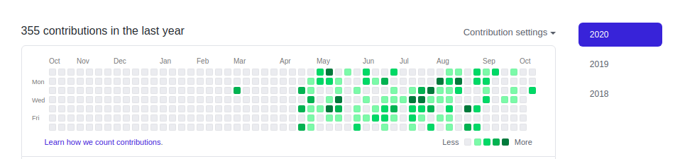
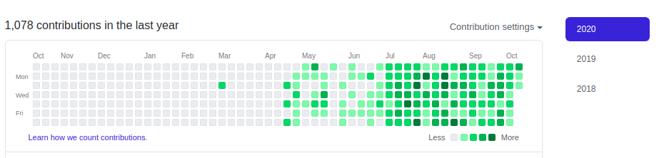

# Github Contribution Graph Hack


[](./LICENSE)

A simple GitHub trick to extrapolate your contribution graph. It should be used for educational purpose only. Not to take unfare advantage over others.
Make sure you have must have Python 3 installed.

Watch youtube video here [Link to video](https://youtu.be/gGHLcr3CQos)

```
python3 --version
Python 3.7.6
```

### Usage Instructions
create a text file bot.txt (or any other txt file and change its name accordingly in main.py)

Run main.py using the command 
```
python3 main.py
```
It may take few seconds depending upon the configuration of your machine.

### Output Looks like


to



# License

[The MIT License (MIT)](LICENSE)
