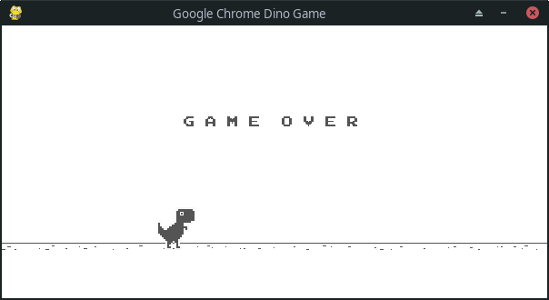

# Google Chrome's Dino made with [PyGame](https://www.pygame.org)

The original repository is avaliable [here](https://github.com/jjpaulo2/chrome-dino-pygame).

This is a simple example what Pygame can do. To see more, get the official pygame news [here](https://www.pygame.org).

### Dependencies

Please, verify that you have **virtualenv** and **pipenv** installed.

- Python (3.8)
- Pygame (1.9.6)

### Running

    $ git clone https://github.com/jjpaulo2/chrome-dino-pygame.git
    $ cd chrome-dino-pygame

If you have **virtualenv** and **pipenv** installed, you can do:
    
    $ pipenv install
    $ pipenv run dino

However, if don't have it, you can get only:

    $ python3 src/main.py

### Screenshots

---

#### Made with :hearts: by [@jjpaulo2](https://github.com/jjpaulo2)