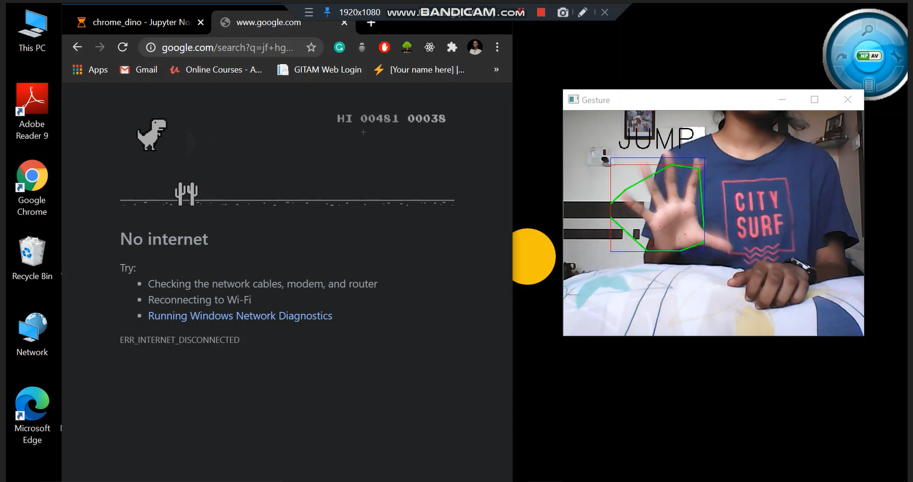
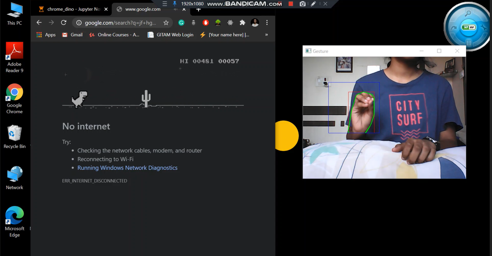

# Chrome Dinosaur Game

### Libraries used:
1. NumPy (Python Package)
2. OpenCV
3. PyAutoGUI (Python Module)

### Steps:
1. Open up the camera and draw a rectangle
2. Blur the image and convert it from BGR to HSV
3. Threshold and mask the image
4. Contour the image
5. Run the code and play!

### Dinosaur Jump

### Dinosaur Run

### End.

 
