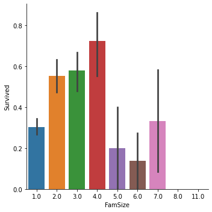
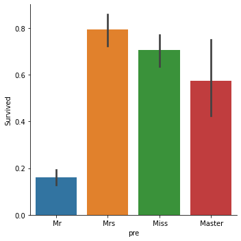
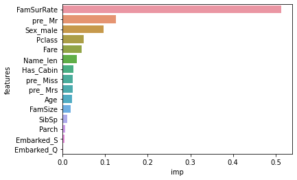

[][kaggle-url]

## About The Compitition
We all know about legendary movie **Titanic**,that romatic story is unfortunately fictional, but the disaster was real.
On April 15, 1912, the widely considered “unsinkable” RMS Titanic sank after colliding with an iceberg. Unfortunately, there weren’t enough lifeboats for everyone onboard, resulting in the death of 1502 out of 2224 passengers and crew.
While there was some element of luck involved in surviving, it seems some groups of people were more likely to survive than others.
Kaggle provides us train and test data sets, which containts details like **Sex,Age,Passenger Class,Embarked etc**,.Our job is to find who had survived in test data set.

<!-- PROJECT LOGO -->
![][product-screenshot]


<!-- TABLE OF CONTENTS -->
## Table of Contents

* [About the Compitition](#about-the-compitition)
* [Brief Overview](#brief-overview)
* [What If You were on Titanic?](#what-if-you-were-on-titanic)
* [Deployment of Titanic Survivor Classifier](#deployment-of-titanic-survivor-classifier)
* [Deployment Dependencies](#deployment-dependencies)
* [Libraries used in Jupyter Notebook](#Libraries-used-in-jupyter-notebook)


## Brief Overview
In data set there are **missing values**, some hidden but important features like name **Prefix,Family Size**,which plays good role predicting person's survive chance,
we imputed missing values with **Random Forest Regressor** which is way more accurate than filling with **Mean,Median or most frequent value(Mode)**.
Then we used different models and tune them and pick the best model for our final prediction.
```sh
df.isna().sum()
```
```sh
PassengerId      0
Survived       418
Pclass           0
Sex              0
Age            263
SibSp            0
Parch            0
Ticket           0
Fare             1
Embarked         2
```
**Filling Fare with median value 'cause there is too many outliers to affect our mean**
<div>
    <a href="https://plotly.com/~Aditya1112/1/?share_key=XvEsaVIjQk5BfDfei4pvWg" target="_blank" title="box" style="display: block; text-align: center;"></a>
</div>

**Family Size,Name Prefix and Their Survive Chance**

   

**Family Size with 2,3 and 4 had higher chance of Survive,**

**Similarly,prefix Mr[Married Man :(  ] had very low chance of Survive**

**Tuning Diffrent model and predict the future with best model**

KNN model's accuracy over K values
<div>
    <a href="https://plotly.com/~Aditya1112/3/?share_key=ELO7dxrEVylMHSaYk1tPKp" target="_blank" title="knn_lie" style="display: block; text-align: center;"></a>
</div>

After some try and error **Random Forest** stand out
```sh
confusion_matrix(y_test,y_pred_rfc)
```
Output:
```sh
array([[268,   5],
       [  2, 171]])
```
**Feature Importance**:


Prefix Mr,Sex_male and Passenger Class are **Highly correlate** to Wheather pearson survive or not.


# What If You were on Titanic?
Suppose you were on Titanic (1912) and you are using widest network sim Airtel.you want to know weather you survive or not if titanic disaster happen. Let's figure out by given heroku app link.

### Deployment of Titanic Survivor Classifier
For deployment I've used full titanic dataset rather than only training datase to make performance much better. 
Final Heroku app takes some user inputs like Passenger Class,Age,Sex,etc,.And predict weather person will Survivr or Not using Machine Learning Model. It's completly based on previous titanic data and being predict by Random Forest algorythm's patterns. Trainnig accuracy is 77.07%, there is always some errors in predictons but we are more confidence with these results.


[][heroku-url]


### Deployment Dependencies:
 * PyCharm
 * Django
 * Heroku
 * Joblib
 * postgresql
 * gunicorn
 
### Libraries used in Jupyter Notebook
* Pandas
* Numpy
* Seaborn,Matplotlib
* Plotly
* Dataprep
* Sklearn
* xgboost


[Titanic Data Set](https://www.kaggle.com/c/titanic)

background image source:History-uk.com: The Sinking of RMS Titanic


<!-- MARKDOWN LINKS & IMAGES -->
<!-- https://www.markdownguide.org/basic-syntax/#reference-style-links -->
[product-screenshot]: https://miro.medium.com/max/2000/0*TVXbu3DbzLtnfGRk.jpg
[heroku-url]: https://titanic101.herokuapp.com/
