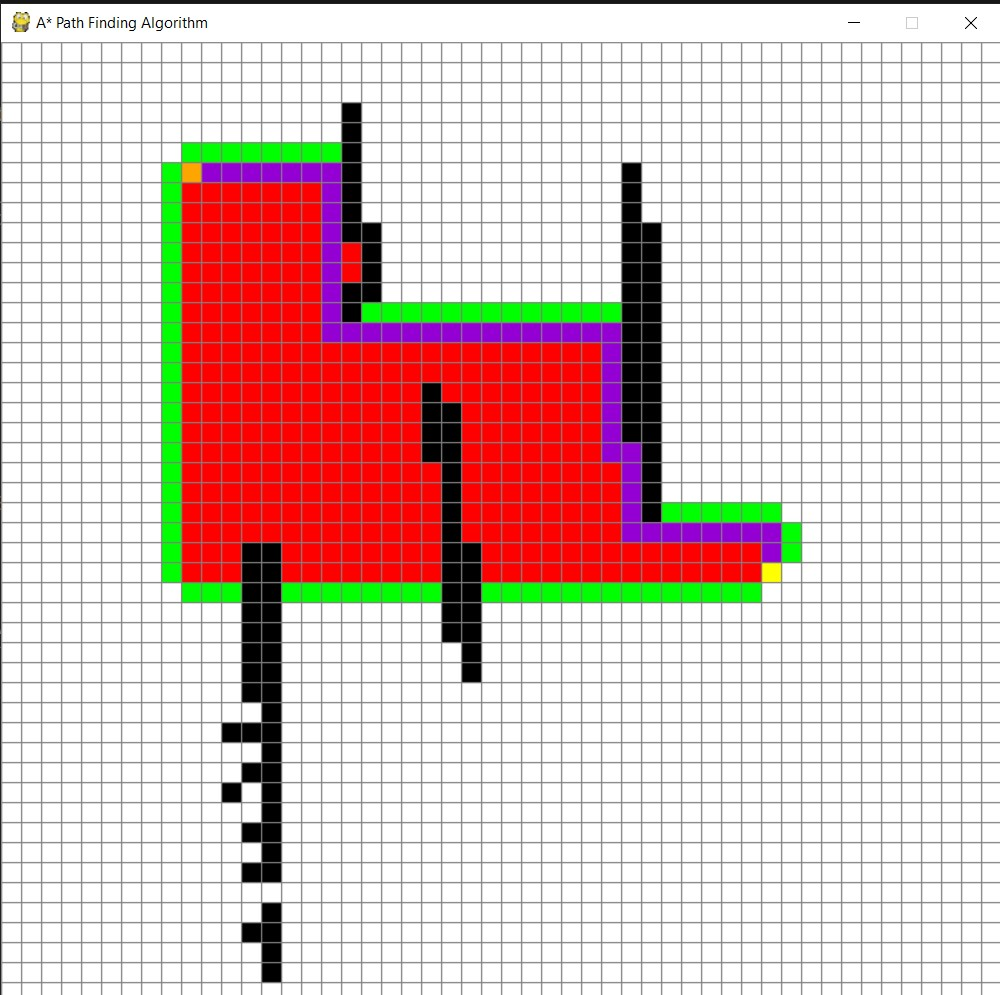
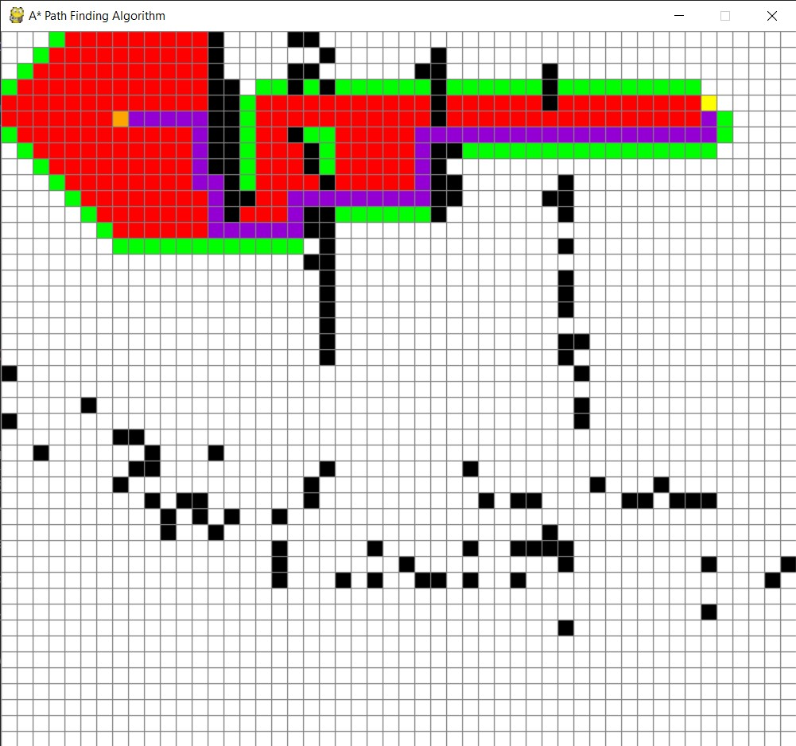

# A-star-algorithm
A* path finding algorithm is implemented in Python using Pygame.

## What is this program ?? 
We have a grid in front of us and we can place a starting point, end point and black colored barriers using left click.

These points can be removed using right click.

Pressing **Space** will start the algorithm.

The **purple path** is the shortest path !!

Pressing **C** clears the grid to start over again.

## Output Example 1

## Output Example 2

