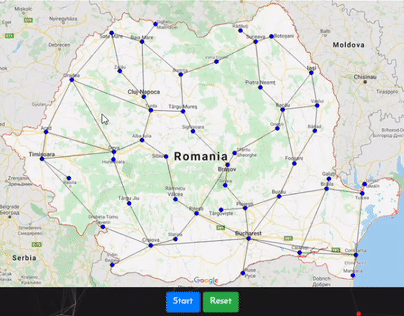

# Graph Searching Algorithm - GUI

- Live project is available <a href="https://projects.itsjigyasu.me/graph-search-gui/">here</a>

## About
- Breadth-first search (BFS) is an algorithm for traversing or searching tree or graph data structures. It starts at the tree root (or some arbitrary node of a graph, sometimes referred to as a 'search key'), and explores all of the neighbor nodes at the present depth prior to moving on to the nodes at the next depth level.
- This project helps to visualise Breadth First Search Algorithm (BFS) over Romania Map.

  - Frontend:
    - HTML
    - CSS

  - Backend:
    - Javascript
    - p5 JS (Processing JS)
 
## Demo

## Implementation
- The Application require data of city in JSON format which has 3 attributes (Name, (X, Y) coordinates & Edges List). The program collectes the data of each city and processess it to create Node objects and put each Node in a graph array. Along with this, the edges list is also updated in Node instance and two connections between the Nodes are created.Then the collected data is processed with p5 JS library and Node Pointers are drawn over the HTML Canvas which has background of Romania Map. And consecutive Edges are also draw using lines. Now a event listener is created for detecting mouse click and when the mouse clicks over any valid node, that node is selected as Starting Node and 2nd click of mouse assigns Destination Node. Then on pressing start button the Breadth First Search Algorithm starts working and according to iterations each node is assigned with its parent node and on successfull finding of destination node the path traced by the algorithm is drawn over canvas and final shortest path is highlighted with green color.

## Author
- Jigyasu Prakash - [JigyasuPrakash](https://itsjigyasu.me)
