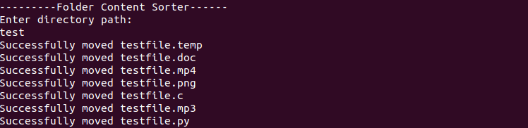

# Folder Content Sorter
This is a Folder Content Sorter that moves the files to various folder depending upon its type.

In the CLI application in which you can input relative directory and the application categorizes files into various types and moves into their respective folders. 

