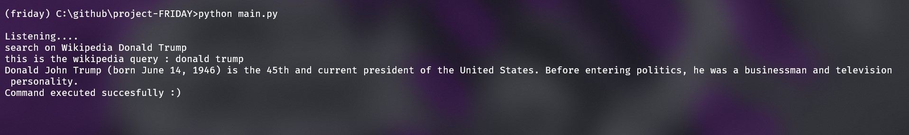
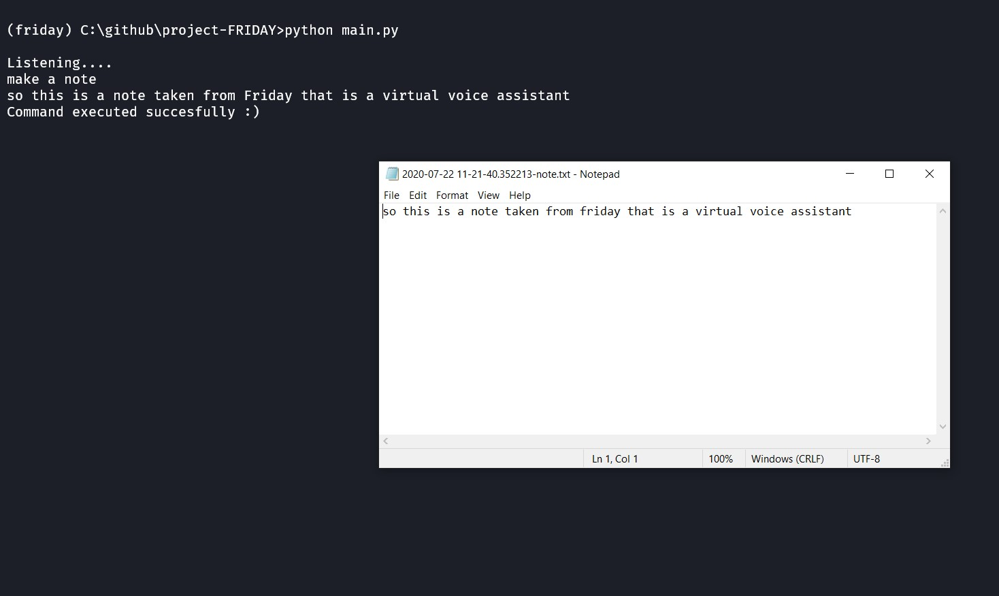
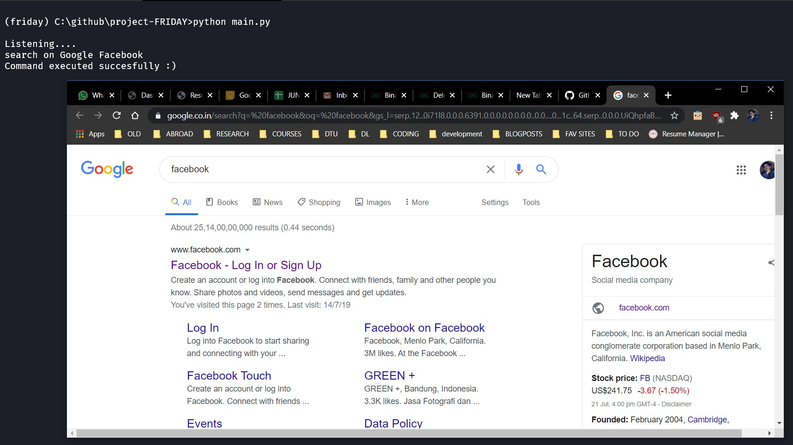
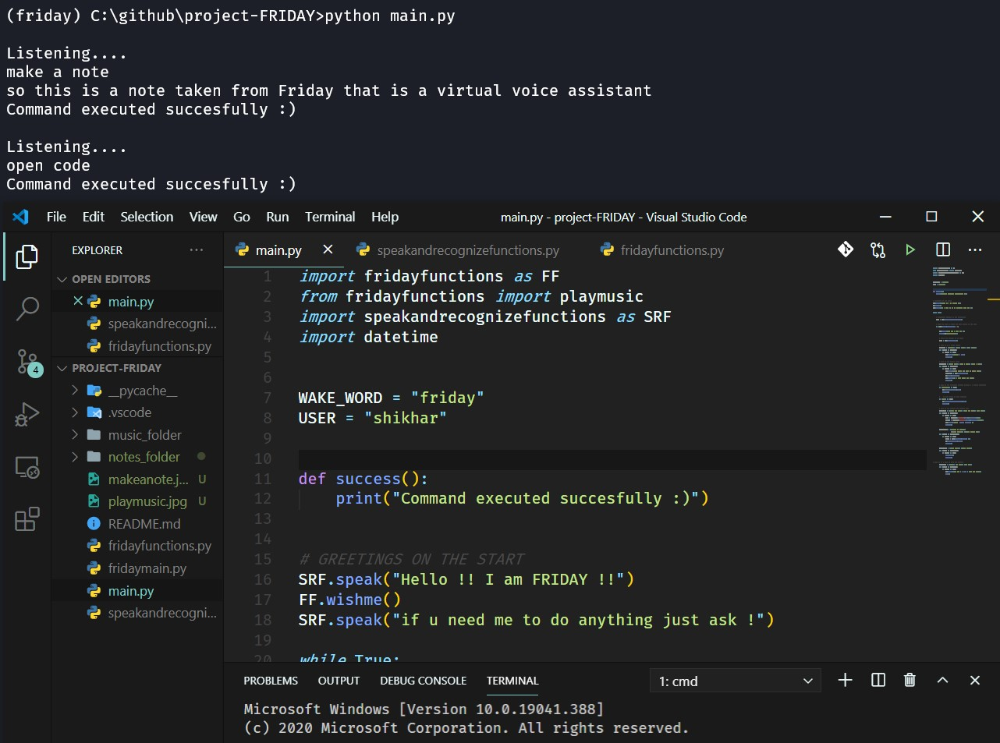
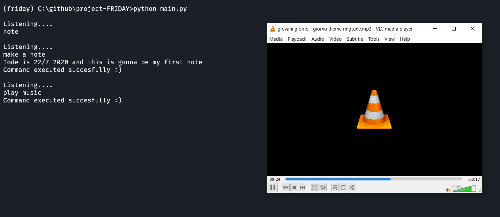

# project-FRIDAY
Voice assistant 'FRIDAY' developed using python inspired by Iron man's AI of the same name. 
FRIDAY detects **user's voice**, converts it into string and detects the command and execute it.

## MODULES 
Several modules are used to make this program, they are as follows:
- *pyttsx3* (python text to speech)
- *Microsoft's speech API* (sapi5 , this is used as the base for pyttsx3 speech engine) 
- *speech_recoginition* (uses google's recognizer function it need an active internet function)
- *wikipedia* (to gather information summary from wikipedia)
- *os , random , subprocess , datetime* (these are some modules used to give various small functionalities)

## How it works 
FRIDAY is constantly working and hearing what the user say but the whenever the user say the *wake word* that is "FRIDAY", it listens the the users query.
If the query is succesfull it goes on to again in its older state waiting for you to say the wake word , if u wanna close the program you could ask friday to exit or go away.

Some of the **funcitons** FRIDAY can perform : 
  
  ## Search about topic on Wikipedia
  
  
  ## Taking Notes 
  
  
  ## Search your query on google
  
  
  ## Open programs on user's windows computer
  
  
  ## It can play music
  
  
  ## Other functionality
    - Wish the user 
    - tell the time
    - open specific websites that are fed into the program
    - exit on saying bye bye ot go away

  
**AREA OF IMPROVEMENT**

This project is hardcoded and in future, I will apply machine learning and natural langauge processing to increase efficiency.

