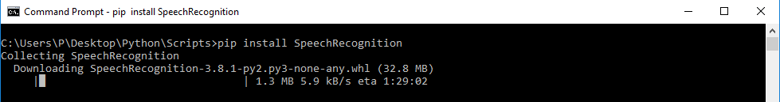
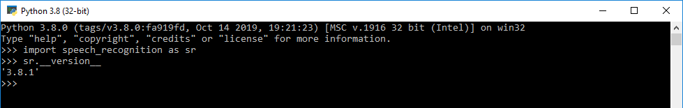
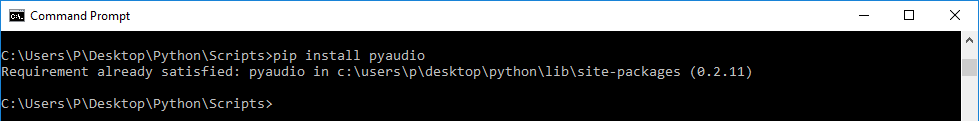
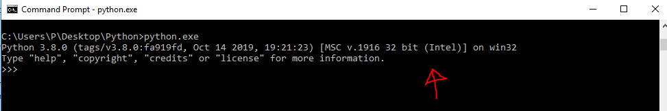
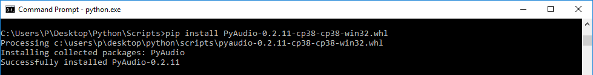
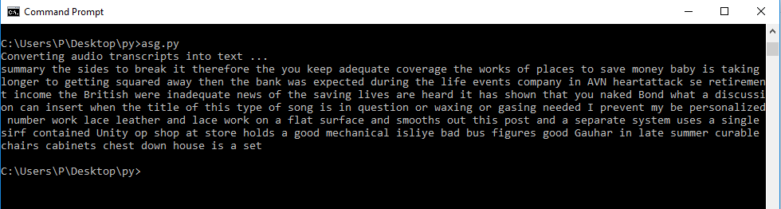
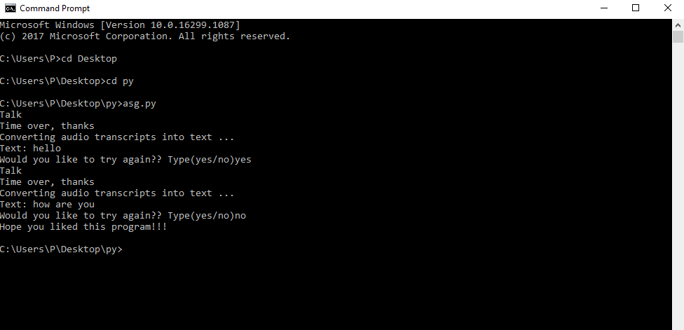

# Python SpeechRecognition (Speech to Text) :sound::ear::speech_balloon:
Have you ever wondered how to add speech recognition to your Python project? If so, then keep reading! It’s easier than you might think.

## Pre-Requisites
* Working knowlwdge of **Python**
* **Python** 2.6, 2.7, or 3.3+ (required):snake:
* **PyAudio** 0.2.11+ (required only if you need to use microphone input, **Microphone**):microphone::headphones:

## **What is Speech Recognition??**
Speech recognition, the ability of devices to respond to spoken commands. Speech recognition enables hands-free control of various devices and equipment (a particular boon to many disabled persons), provides input to automatic translation, and creates print-ready dictation.

**In Simple words:**

**Speech recognition** system basically translates spoken language into text.

## **How Speech Recognition works??**:point_down:
Without all the **Technical Details** in simple words we can say:

The first component of speech recognition is, of course, speech. Speech must be converted from physical sound to an electrical signal with a microphone, and then to digital data with an analog-to-digital converter. Once digitized, several models can be used to transcribe the audio to text.

Most modern speech recognition systems rely on what is known as a [Hidden Markov Model](https://en.wikipedia.org/wiki/Hidden_Markov_model) (HMM). 


## **Python Speech Recognition Packages**
* Google Speech Recognition
* [CMU Sphinx](https://cmusphinx.github.io/wiki/) (works offline)
* [wit](https://pypi.org/project/wit/)
* [watson-developer-cloud](https://pypi.org/project/watson-developer-cloud/)
* [google-cloud-speech](https://pypi.org/project/google-cloud-speech/)

There is one package that stands out in terms of ease-of-use and we are gonna use this package: **SpeechRecognition**.

## **Installing the Required Packages**
### 1. **You can install SpeechRecognition from a terminal with pip:**
```python
   pip install SpeechRecognition
```


**OR** You can download the package  and extract it in the required folder --->> [Download](https://pypi.org/project/SpeechRecognition/#files) 

**Once installed, you should verify the installation by opening an interpreter session and typing:**
```python
   >>> import speech_recognition as sr
   >>> sr.__version__
       '3.8.1'
```




### 2. **Installing PyAudio using pip:**
We need to install PyAudio library which used to receive audio input and output through the microphone and speaker. Basically, it helps to get our voice through the microphone.
```python
   pip install PyAudio
```


Since I have already installed it.It shows requirement satisfied..:point_up:

# If you have any errors trying to install using *(pip)* follow these simple steps below:
* Find your python version,the easiest way to check either you have 64 or 32 Python just open it in the terminal:



* Find the appropriate `.whl` file from [here](https://www.lfd.uci.edu/~gohlke/pythonlibs/#pyaudio), **for example:** mine is `PyAudio-0.2.11-cp38-cp38-win32`, and download it.   
* Go to the folder where you saved it after downloading **for example:**`C:\Users\P\Desktop\Python\Scripts`.
* Install the `.whl` file with `pip` for example:
```python
   pip install PyAudio-0.2.11-cp38-cp38-win32.whl
```


******
******
# Simple Speech to Text (Speech Recognition) Project :sound::ear::speech_balloon:
# Lets move on to the more fun part which is the coding.................

## Without using Microphone/Using an Audio File:
* **Works without PyAudio**
* **Import Speech recognition library**
```python
   import speech_recognition as sr
```
* **Initializing recognizer class in order to recognize the speech. We are using google speech recognition.**
```python
   r = sr.Recognizer()
```
* **Audio file supports by speech recognition: wav, AIFF, AIFF-C, FLAC. I used ‘wav’ file in this example**
```python
   with sr.AudioFile('male.wav') as source:
      audio_text = r.listen(source)
      try:
         # using google speech recognition
         print('Converting audio transcripts into text ...')
         text = r.recognize_google(audio_text)
         print(text)
     except:
         print('Sorry.. run again...')
```
> I have used a random `.wav` from internet.You can also download `.wav` files from internet and try speech recognition on them
> You need to be **aware that this is a very basic speech recognition program** so you can't expect everything to be correct....
* **This was the result for the following [male.wav](https://www.signalogic.com/melp/EngSamples/Orig/male.wav) file.**



### Final code:
```python
   #import library
   import speech_recognition as sr
   # Initialize recognizer class (for recognizing the speech)
   r = sr.Recognizer()
   # Reading Audio file as source
   # listening the audio file and store in audio_text variable
   with sr.AudioFile('male.wav') as source:
      audio_text = r.listen(source)
      # recoginize_() method will throw a request error if the API is unreachable, hence using exception handling
      try:
         # using google speech recognition
         print('Converting audio transcripts into text ...')
         text = r.recognize_google(audio_text)
         print(text)
      except:
         print('Sorry.. run again...')
 ```
   

# Using Microphone  for Speech Recognition :microphone:
* **Need to install PyAudio**
* **Instead of audio file source, we have to use the Microphone class. Remaining steps are the same.**

**Final code:**
```python
   #import library
   import speech_recognition as sr
   # Initialize recognizer class (for recognizing the speech)
   def recog():
      r = sr.Recognizer()
      # Reading Microphone as source
      # listening the speech and store in audio_text variable
      with sr.Microphone() as source:
         print("Talk")
         audio_text = r.listen(source)
         print("Time over, thanks")
         # recoginize_() method will throw a request error if the API is unreachable, hence using exception handling
         try:
            # using google speech recognition
            print("Converting audio transcripts into text ...")
            print("Text: "+r.recognize_google(audio_text))
        except:
            print("Sorry, I did not get that")

   while(True):
      recog()
      x=input("Would you like to try again?? Type(yes/no)")
      if (x=='yes'):
         continue
      elif (x=='no'):
         print("Hope you liked this program!!!")
         break
      else:
         print("Invalid option")
         break
   ````
   
   # If you follow the above and try and implement the code..The code will definetly work....:smile::+1:
   # If you don't believe me you can check the video below..
   # Pardon my video skills.:sweat_smile::smile:
   * [Video1](extras/exp1.mp4)
   * [Video2](extras/exp2.mp4)
   
   **Result:**
   
   
   
   # Hope You have learnt something new....:smile:
   # Happy Learning :smile::+1:
   
   
   **Contributor: Mutukundu Mahendra Reddy**
   You can reach me out on my mail:***reddymahendra52@gmail.com***
   
   
   
   
   
   
   
   
   
   
   
   
   
   
   
   
   
   
   
   
   
   
   
   
   
   
   
   
   
   
   
   
   
   
   
   
   
   
   
   
   
   
   
   


