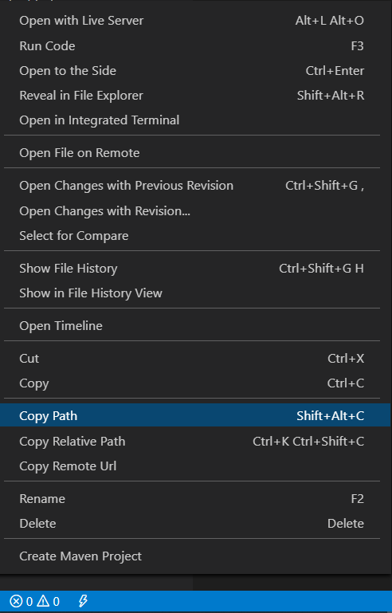
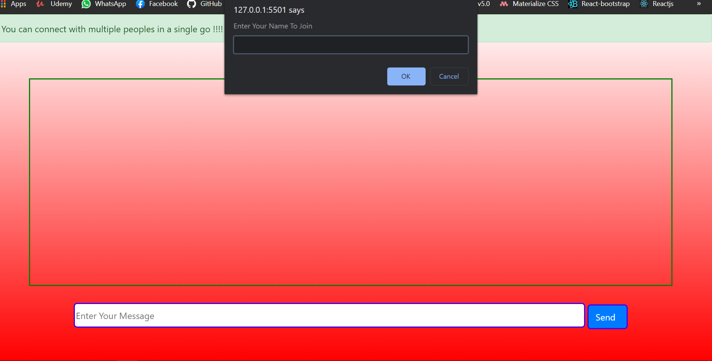
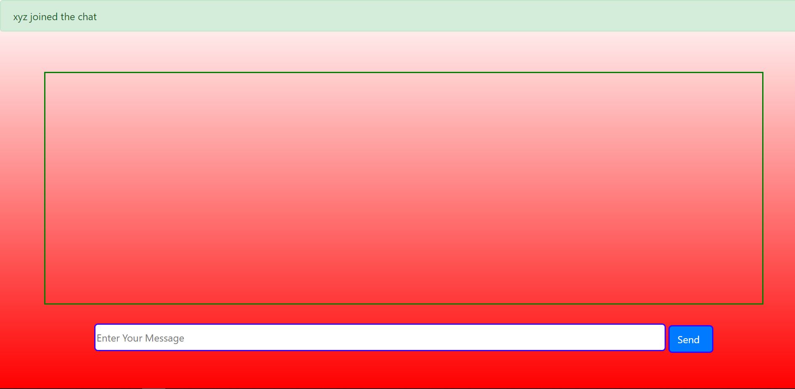
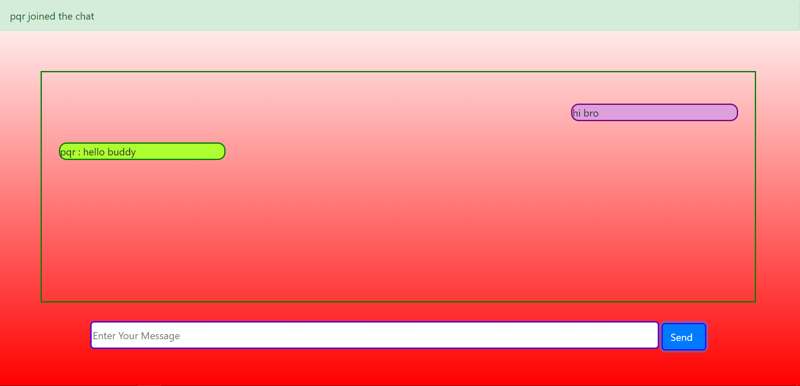

# Chat App 

 Hello viewers , I have made this awesome Web Based Chat Application that is very scalable and can connect multiple peoples at a time and they can have a group chat.
I made a custom backend for this chat app using socket.io package of node

## Steps to make this app working 
### 1. Move to the folder nodeserver and start the server 
``` npm
node index
```
### 2. Then open your index.html via live server or by copying the relative path in the browser url



### 3. Then You have to enter your name in the prompt 



### 4. Whenever a new user joined you get an alert at the top 



### 5. Then you can start your conversion and each user's name is displayed before the message




